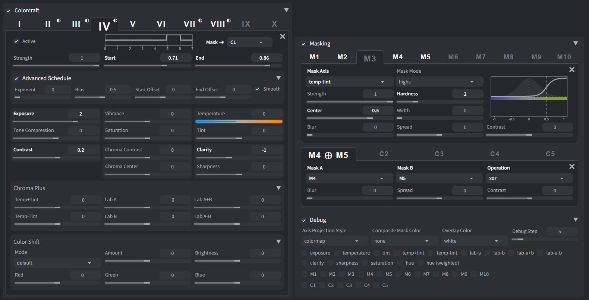
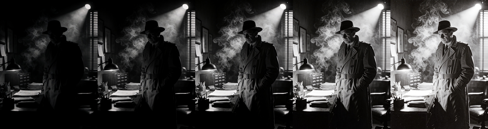
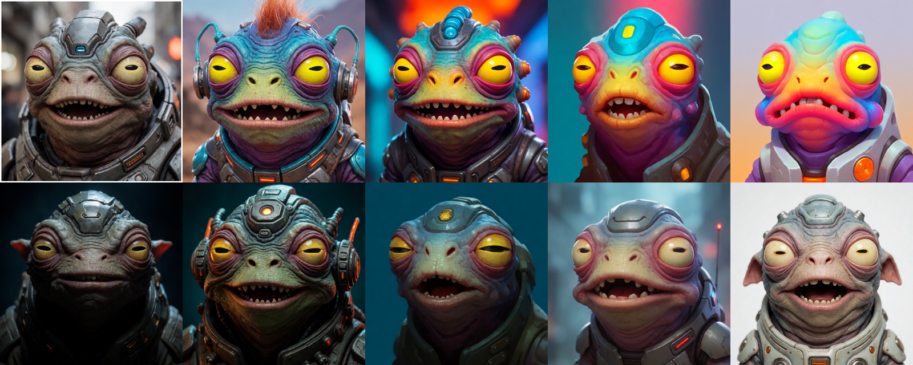

<div align="center">

# COLORCRAFT

### Color grading for ComfyUI, applied where it actually matters: inside the diffusion process itself!

<!-- TODO: hero image -->
<!--  -->

<!-- Badges — post-launch, once the repo has stars/downloads to show


-->

**[Why?](#why-not-just-do-it-in-post) • [Nodes](#nodes) • [Gallery](#gallery) • [Requirements](#requirements) • [Installation](#installation) • [Getting Started](#getting-started) • [Workflows](#workflows) • [Wiki](#wiki)**

</div>

---

Colorcraft is a set of modular nodes that chain together (ComfyUI) or sequential adjustment layers (Forge Neo), that lets you build your own custom color-editing pipeline out of modifiers, schedules, and masks. Mix and match exactly what your shot needs.

Between the axes and masks on offer, it's close to the full toolset of something like Lightroom or Camera Raw... applied somewhere those guys could never reach: mid-generation, in latent space.

<table width="100%">
  <tr>
    <td align="center" width="50%">
      
      <br>
      <sub>ComfyUI Nodes</sub>
    </td>
    <td align="center" width="50%">
      
      <br>
      <sub>Forge Neo Extension  — screenshot uses <a href="https://github.com/muerrilla/sd-webui-neutrino">Neutrino</a></sub>
    </td>
  </tr>
</table>

Exposure, Contrast, Tone Mapping, Saturation et al., White Balance/Tint, Hue Shifting, Split-toning/Cross-processing, and Range Masking, all done without LoRAs, prompt hijinks, CFG boost, post-processing effects, etc., just using pure vector math on the latent.

And since it's just simple vector math, **it's computationally close to free!**

## Why not just do it in post?

Most color tools work on finished images after the fact: a curve, a LUT, a filter laid over pixels that are already locked in. Colorcraft reaches into the latent while the image is still being formed, and shapes color the same way the model itself does, along real, meaningful axes of the space it thinks in, rather than the red/green/blue channels of a decoded image.

It's the difference between metering a shot correctly at capture versus fixing the exposure in post, or mixing the right color on the palette versus color-correcting a finished painting. Latents carry far more dynamic range than a decoded image, so there's real headroom to work with: proper HDR-range color, not a clipped approximation of it.
<br>
<p align="center">
<a href="assets/dynamic-range.jpg"></a>
<br><sub>High Dynamic Range: middle is the original — note the lamps and the shutters</sub>
</p>
And because the edit happens while the image is still forming, it doesn't just recolor the result: it can steer the generation itself (e.g. making darker, brighter, or more colorful compositions than the model would produce on its own). You can even push or pull fine detail and texture directly, something no post-process filter can genuinely add back once it's gone.
<br><br>
<p align="center">
<a href="assets/steering.jpg"></a>
<br><sub>Steering: top-left is the original, the rest use same prompt/seed with different edits applied at early steps</sub>
</p>
Oh, and also, you won't need a second software or process. You do it all in one go.

## Features
<details>
<summary><b>ComfyUI Nodes</b></summary>
  
### Main:
- **Sampler** — the actual workhorse. All modifiers with their schedules and masks chain together and end up here
- **Schedule** — build one schedule and share it across several modifiers, or use one per modifier
### Modifiers:
- **Basic** — contrast and color shift, works on any model
- **Advanced** — the full toolkit in one mega-node
- **Luma** — exposure, tone compression
- **Chroma** — temperature, tint, vibrance, saturation, chroma contrast
- **Chroma Plus** — more hue axes, for when temperature/tint isn't enough
- **Punch** — contrast, clarity, sharpness
- **Shift** — push/pull colors towards a specifically defined color
### Masking:
- **Masking** — key any edit by luminance, hue, and more
- **Combine Masks** — build up complex, compound masks from simple ones
- **Refine Mask** — refine masks using blur, spread, and contrast control
### Debugging:
- **Debug** — view image components (exposure, saturation, etc.) and their stats, and preview masks

</details>

<details>
<summary><b>Forge Neo Extension</b></summary>
  
### Modifier Tabs:
- A stack of 10 modifier tabs is available, and the active ones will run in sequence
- Each modifier has its own schedule
- Each modifier exposes the full set of adjustments
- Each modifier can use a single mask or combo
### Masking Accordion:
- 10 Mask tabs are available for range masking
- 5 Mask Combo tabs are available for combining masks using AND/OR/SUB/XOR operations
- Masks and Combos can be refined using Blur/Spread/Contrast control
### Debug Accordion:
- Pick a sampling step and the image components and masks you want to preview, get the results after generation

</details>

## Gallery

*Before/after comparisons coming soon.*

<!-- Uncomment and duplicate per comparison once ready:
<table align="center">
<tr>
<td align="center"><br><sub>Before</sub></td>
<td align="center"><br><sub>After</sub></td>
</tr>
</table>
-->

## Requirements

- [ComfyUI](https://comfy.org/) / [SD Webui Forge Neo](https://github.com/Haoming02/sd-webui-forge-classic/tree/neo)
- **Basic** node (Contrast slider and Color Shift sliders in Neo) should work with any model that has a VAE, no restrictions
- Every other node needs a matching basis for the model's VAE family. Currently supported:
  - **Qwen Image VAE Family** — **Krea2** / Qwen Image / Anima / ...
  - **Flux AE Family** — **Z-Image** / Flux / ...

> [!NOTE]
> I have only tested on **Krea2** and **Z-Image**. So, feedback would be much appreciated on how it fares with **Anima**, **Qwen Image**, etc.

> [!IMPORTANT]
> The nodes are designed for the classic ComfyUI UI. Nodes 2.0 is not supported until there's at least some dev docs for it.

## Installation
<details>
<summary><b>ComfyUI</b></summary>
<br>
  
**Via ComfyUI Manager:**

Open Manager → **Install via Git URL** → paste `https://github.com/muerrilla/ComfyUI-Colorcraft` → Confirm.

**Manually:**
```
cd ComfyUI/custom_nodes
git clone https://github.com/muerrilla/ComfyUI-Colorcraft.git
```
Restart ComfyUI and refresh your browser. The nodes appear under **Muerrilla → Colorcraft** in the node menu.

</details>
<details>
<summary><b>Forge Neo</b></summary>
<br>
  
**Via Extensions Tab:**

Go to Extensions → **Install from URL** → paste `https://github.com/muerrilla/ComfyUI-Colorcraft` into first field → Install

**Manually:**
```
cd sd-webui-forge-neo/extensions
git clone https://github.com/muerrilla/ComfyUI-Colorcraft.git
```
Restart Forge Neo. The extension appears within your extension accordions on txt2img and img2img tabs.

**Theme:** 

Want a nice minimalist UI theme to go with it? Check out [Neutrino](https://github.com/muerrilla/sd-webui-neutrino)

</details>

## Getting Started

- Drop in the `Colorcraft Sampler` node, provide the required VAE and sampler (`KSamplerSelect`), and plug it into a `SamplerCustom` node.
- Build out from there: chain together the modifiers you want and feed them into `Colorcraft Sampler`.  
  (e.g. `Colorcraft Luma` for exposure → `Colorcraft Punch` for contrast → `Colorcraft Sampler`)
- Every modifier node (excl. `Colorcraft Basic` and `Colorcraft Advanced`) requires a `Colorcraft Schedule` input.
- Every modifier node (excl. `Colorcraft Basic`) can take an optional mask through the `masking` input.

> [!TIP]
> **Timing is key:** Every adjustment rides its own schedule across the sampling steps. Early steps steers the generation; later steps behave like straightforward color correction, faithful to what was already forming.

> [!TIP]
> **Adjustment can be gated by a mask:** These are not hand-painted masks, but live reads of the image's own luminance, hue, etc., So besides things like adjusting only shadows or highlights, you can target "the warm highlights" or "everything except skin tones" using combined masks.

> [!IMPORTANT]
> **Be gentle, or give the model time to heal:** If your edits are too strong, they will eventually break the latent and create artifacts. In those cases you'd better spread the edit across multiple steps and/or avoid applying the edit on the last few steps, giving the model some time to recover. In general, try to avoid applying an edit on the very last step (unless it is ***very*** mild).

## Workflows

A handful of annotated example workflows are included in `workflows/` folder. Drop any of them straight into ComfyUI to get oriented. A wider set covering the more advanced adjustments and masking/scheduling tricks is coming shortly.

<table align="center">
<tr>
<td align="center" width="150"><a href="workflows/Colorcraft%20-%20Getting%20Started.png"></a><br><sub>Getting Started</sub></td>
<td align="center" width="150"><a href="workflows/Colorcraft%20-%20Luma.png"></a><br><sub>Luma</sub></td>
<td align="center" width="150"><a href="workflows/Colorcraft%20-%20Chroma.png"></a><br><sub>Chroma</sub></td>
<td align="center" width="150"><a href="workflows/Colorcraft%20-%20Punch.png"></a><br><sub>Punch</sub></td>
<td align="center" width="150"><a href="workflows/Colorcraft%20-%20Chroma%20Plus.png"></a><br><sub>Chroma Plus</sub></td>
<td align="center" width="150"><a href="workflows/Colorcraft%20-%20Shift.png"></a><br><sub>Shift</sub></td>
<td align="center" width="150"><a href="workflows/Colorcraft%20-%20Advanced.png"></a><br><sub>Advanced</sub></td>
<td align="center" width="150"><a href="workflows/Colorcraft%20-%20Advanced%20Masking.png"></a><br><sub>Advanced Masking</sub></td>
<td align="center" width="150"><a href="workflows/Colorcraft%20-%20Mask%20Preview.png"></a><br><sub>Mask Preview</sub></td>
</tr>
</table>

> [!NOTE]
> Provided workflows are all based on Krea2. Change the Diffusion Model, CLIP, and VAE to make them work with Z-Image or any other model that uses either Qwen Image VAE or Flux AE.  
> 
> You might have to re-adjust the modifier sliders to get the same adjustment intensities for different models.

## Wiki

The full wiki (per-node parameter reference, deeper technique breakdowns) is coming soon.

## Credits

The sigma-to-step handling is adapted from Jonseed's ComfyUI port of Detail Daemon: https://github.com/Jonseed/ComfyUI-Detail-Daemon
